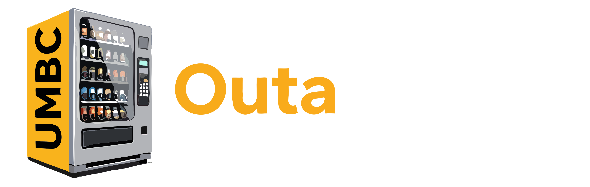

<div align="center">
  <a href="https://go.dev/"></a>
  <a href="https://react.dev/"></a>
  <a href="https://www.typescriptlang.org/"></a>
  <a href="https://www.postgresql.org/"></a>
  <a href="https://caddyserver.com/"></a>
  <a href="https://www.docker.com/"></a>
  <br />
  <br />
</div>

<div align="center">
  <a href="https://github.com/jacomemateo/OutaStock">
    
  </a>
  <p align="center">
    Vending Machine Inventory Tracking System
  </p>
</div>

## Project Overview

OutaStock is a vending machine inventory and transaction tracking system built with:

* Go backend
* React + Vite frontend
* PostgreSQL
* Caddy reverse proxy
* ZITADEL for authentication
* Terraform for local ZITADEL/project/application bootstrap

Transaction data is based on a CBORD CSV export where each vend includes a timestamp and sale price.

| DateTime | Transaction Price |
| ---- | --- |
| 2025-02-25 12:20:32 | $1.50 |
| 2025-02-25 12:21:34 | $2.25 |

Because each item in the machine has a unique price, the system can infer which product was sold from the logged transaction amount.

At a high level, the system is responsible for:

* Managing a catalog of products and their prices
* Tracking which products are stocked in each machine slot
* Monitoring current inventory levels
* Recording completed sales transactions
* Preserving historical pricing data at the time of sale
* Restricting dashboard access behind ZITADEL authentication

The project emphasizes clean architecture, clear service boundaries, and a usable dashboard for day-to-day vending machine management.


## Authentication
Default local admin credentials:

* Username: `admin`
* Password: `SecurePassword123!`

ZITADEL console:

* [http://auth.localhost/ui/console](http://auth.localhost/ui/console)

## Prerequisites

Clone the repository:

```bash
git clone https://github.com/jacomemateo/OutaStock/
cd OutaStock
```

Install the required tools:

* Go
* Docker
* Node.js + npm
* Task
* Air
* Terraform

Example Homebrew install:

```bash
brew install go
brew install docker
brew install node
brew install go-task/tap/go-task
brew install air
brew install terraform
```

You will also need Docker Desktop running locally.

## Environment Files

Production uses:

* `.env`
* `.env.example` as the template

Development uses:

* `.env.dev`
* generated `.env.dev.local`
* generated `web/.env.local`

Generated auth/runtime files:

* `terraform/zitadel-web.env`
* `terraform/zitadel-backend.env`
* `terraform/bootstrap/zitadel-admin-sa.json`
* `.env.dev.local`
* `web/.env.local`

Do not hand-edit generated files unless you know exactly why you are overriding Terraform output.

Taskfile helpers now handle the normal Terraform auth bootstrap flow automatically:

* `task auth-sync`
* `task dev-auth-sync`

Both commands will:

* wait for local ZITADEL to be reachable
* run `terraform init`
* run `terraform apply`
* regenerate the relevant env files

## Production Workflow

The production-style stack is fully Dockerized and includes automatic local ZITADEL bootstrap.

### First-time production setup

Create `.env` from the template if you do not already have one:

```bash
cp .env.example .env
```

Then start the full stack:

```bash
task prod
```

What `task prod` does:

* ensures `.env` exists
* starts the ZITADEL bootstrap services
* waits for the local machine key
* waits for the OIDC discovery endpoint
* runs `terraform init`
* runs `terraform apply -auto-approve`
* exports frontend/backend auth env files
* builds and starts the full Docker stack

### Production URLs

* App: [http://localhost](http://localhost)
* API docs / reverse-proxied API host: [http://api.localhost](http://api.localhost)
* ZITADEL login / auth: [http://auth.localhost](http://auth.localhost)
* ZITADEL console: [http://auth.localhost/ui/console](http://auth.localhost/ui/console)

### Resetting production locally

To destroy the production-style local stack, Docker volumes, Terraform runtime state, and generated auth artifacts:

```bash
task nuke
```

Then recreate everything:

```bash
task prod
```

If the local ZITADEL bootstrap credential was lost but the Docker volumes still exist, reset the local auth state with:

```bash
task rebootstrap
task prod
```

## Development Workflow

Development mode is optimized for fast frontend and backend iteration.

Use this when you want:

* Vite HMR for the frontend
* Air live-reload for the backend
* real ZITADEL auth
* Docker only for support services

### Start the shared Docker services

In one terminal:

```bash
task dev
```

This starts:

* development Postgres
* Swagger
* Caddy
* ZITADEL database
* ZITADEL API
* ZITADEL login UI

It also:

* waits for ZITADEL to become ready
* runs Terraform against the local instance
* generates `.env.dev.local`
* generates `web/.env.local`

### Start the local backend

In a second terminal:

```bash
task dev-back
```

This runs the Go API locally with `air`.

### Start the local frontend

In a third terminal:

```bash
task dev-front
```

This runs the React app locally with Vite.

Important first-run order:

1. `task reboostrap`
2. `task dev`
3. `task dev-back`
4. `task dev-front`

`task dev-back` and `task dev-front` now depend on `dev-auth-sync`, which means they expect the local ZITADEL bootstrap credentials and OIDC endpoints to exist already.

### Development URLs

* Vite frontend: [http://localhost:5173](http://localhost:5173)
* Local backend: [http://localhost:8080](http://localhost:8080)
* ZITADEL: [http://auth.localhost](http://auth.localhost)
* API host / Swagger through Caddy: [http://api.localhost](http://api.localhost)

### Stop development services

```bash
task dev-down
```

### Reset development services

```bash
task dev-nuke
```

This removes:

* dev Docker containers and volumes
* `.env.dev.local`
* `web/.env.local`

### Recover a broken local auth bootstrap

If `terraform/bootstrap/zitadel-admin-sa.json` was lost but the old shared ZITADEL volumes still exist, normal auth sync can no longer recreate it automatically because ZITADEL first-instance bootstrap only runs on a fresh auth database.

Use:

```bash
task rebootstrap
task dev
task dev-back
task dev-front
```

This will:

* stop dev and prod local stacks
* remove the shared local ZITADEL volumes
* clear local Terraform state
* remove generated auth env files
* allow ZITADEL to recreate the Terraform machine key on the next `task dev` or `task prod`

## Database Tasks

Connect to the production database:

```bash
task connect
```

Connect to the development database:

```bash
task dev-connect
```

Run all seed files against production:

```bash
task seed
```

Run all seed files against development:

```bash
task dev-seed
```

Regenerate SQLC code:

```bash
task generate_sqlc
```

## Formatting

Install formatting tools:

```bash
go install mvdan.cc/gofumpt@latest
go install golang.org/x/tools/cmd/goimports@latest
```

Then run:

```bash
task pretty
```

## Common Tasks

List all tasks:

```bash
task
```

Refresh production auth env files from Terraform outputs:

```bash
task auth-sync
```

Refresh development auth env files from Terraform outputs:

```bash
task dev-auth-sync
```

## Troubleshooting

### Sign-in succeeds but the dashboard does not load

Make sure you are using the correct URL for your current mode:

* Production: `http://localhost`
* Development: `http://localhost:5173`

If auth values changed, regenerate them:

```bash
task auth-sync
task dev-auth-sync
```

### Terraform drift after resetting ZITADEL

If the local ZITADEL instance was reset outside Terraform, remove stale Terraform resources from state and re-apply, or run a full local reset with:

```bash
task nuke
task prod
```

If the problem is specifically a missing `terraform/bootstrap/zitadel-admin-sa.json` file on an otherwise old local ZITADEL instance, use:

```bash
task rebootstrap
task dev
```

or:

```bash
task rebootstrap
task prod
```

### Backend returns `401`

That usually means the route is protected and the frontend is unauthenticated, the token is missing, or the token is no longer valid for the configured ZITADEL app/project.

### Backend returns `503` during auth validation

That usually means ZITADEL is not reachable or not ready yet. Confirm:

* Docker services are running
* [http://auth.localhost/.well-known/openid-configuration](http://auth.localhost/.well-known/openid-configuration) returns `200`

## Additional Docs

* [Architecture](/Users/mateo/Code/School/CMSC447/OutaStock/docs/ARCHITECTURE.md)
* [API Specification](/Users/mateo/Code/School/CMSC447/OutaStock/docs/API.md)
* [Terraform Notes](/Users/mateo/Code/School/CMSC447/OutaStock/terraform/README.md)

## Top Contributors

<a href="https://github.com/jacomemateo/OutaStock/graphs/contributors">
  
</a>
